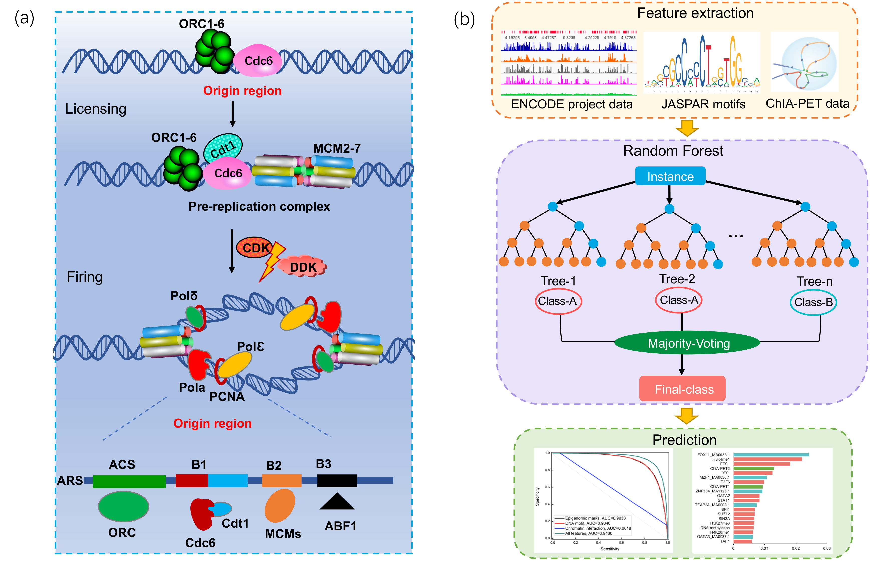

# Accurate Identification of DNA Replication Origin by Fusing Epigenomics and Chromatin Interaction Information

**Overview**

We devised a computational approach to predict replication origin sites (ORIs) using the  epigenomic marks, DNA motifs, and chromatin loops.

**Systems Requirements**

The scripts were written in R and Python language. 

To run the scripts, you need several R packages. To install the packages:
`install.packages(c("pROC","glmnet","ranger","Matrix","ROCR"))` \
`source("https://bioconductor.org/biocLite.R")` \
`biocLite("BSgenome.Hsapiens.UCSC.hg19")` \
`biocLite("BSgenome.Hsapiens.UCSC.hg19.masked")` \
`biocLite("JASPAR2018")` \
`biocLite("TFBSTools")` \

**Usage**

There are two main folders: 
- The folder "data" contains related data from human myeloid erythroleukemia K562 cell, breast cancer MCF-7 cell and HCT116 cell line. 

1. Subfolder "ORI" contains K562 ORI data(train dataset, validation dataset, enhancer dataset, and promoter dataset), and MCF-7 and HCT116 (train dataset with positive and negatuve samples).
2. Subfolder "test_Epi" contains epigenomic marks data, which is as example to extracte epigenomic marks features.
3. Subfolder "test_loop" contains loop data, , which is as example to extracte chromatin interaction features. It is worth noting that the loop in .bedpe format is processed into an anchor in .bed format before use.

- The folder "script" contains following scripts: (When using these scripts, you need to write the right file path)
1. "epigenomic.R" is uesed to extracte epigenomic marks features.
2. "motif.R" is used to extracte DNA motifs features.
3. "3Dfea2.py" is used to extracte chromatin interaction features.
4. "PlusCsv.py" is used to combine three feature files (epigenomic marks features, DNA motifs features, and chromatin interaction features).
5. "RunRF.R" is used to run RF, which is need to input feature file with .csv format.

- The folder "variable importance" contains K562 top 60 features according to variable importance.

**References**
- Accurate Identification of DNA Replication Origin by Fusing Epigenomics and Chromatin Interaction Information

**Contact**:
fydao@std.uestc.edu.cn
